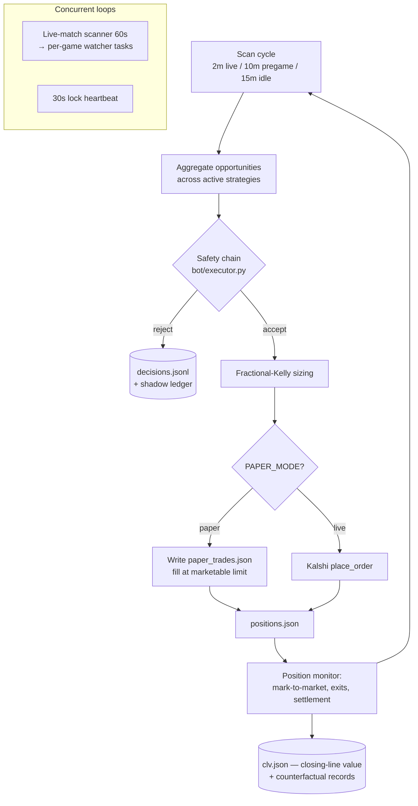

# Glint

> An autonomous prediction-market trading bot, run entirely in **paper-trading mode** as a research harness for discovering — and honestly stress-testing — structural edges on [Kalshi](https://kalshi.com).


-orange)


**Glint is a single-process Python `asyncio` application** that scans Kalshi 24/7, evaluates opportunities with deterministic edge math behind a multi-layer safety chain, sizes positions with fractional Kelly, and records every decision for later analysis. It has **never placed a real-money order** — `PAPER_MODE` has been `True` for its entire life.

The interesting output of this project is not the P&L. It's the engineering and the research discipline used to answer a single question rigorously: *can a retail trader find durable edge in prediction markets, and how would you know?* The honest answer turned out to be **"one small, structural, capacity-capped edge — and most of the things that looked like edges didn't survive scrutiny."** Getting to that answer cleanly is the point.

This README is the front door. The deep operational history lives in [`CLAUDE.md`](CLAUDE.md) (the operator manual: architecture, schema reference, and 18 documented production incidents) and [`CLAUDE-sessions.md`](CLAUDE-sessions.md) (a session-by-session engineering changelog spanning ~160 work sessions).

---

## Contents

- [What this is (and isn't)](#what-this-is-and-isnt)
- [What I learned — the honest results](#what-i-learned--the-honest-results)
- [Architecture](#architecture)
- [The strategies](#the-strategies)
- [Safety architecture](#safety-architecture)
- [Position sizing](#position-sizing)
- [Engineering highlights](#engineering-highlights)
- [Observability & research tooling](#observability--research-tooling)
- [Research methodology](#research-methodology)
- [Project layout](#project-layout)
- [Running it](#running-it)
- [Tech stack](#tech-stack)
- [Disclaimer](#disclaimer)

---

## What this is (and isn't)

**It is** a from-scratch trading-systems research project: an async engine, deterministic strategy math, a full-fidelity paper-trading sandbox, heavy instrumentation, and a disciplined methodology for deciding whether a candidate strategy is *real* before risking anything on it.

**It isn't** financial advice, a money-printer, or a recommendation to trade. `PAPER_MODE = True`; all P&L is simulated against a **$10,500 paper bankroll**. No real capital is at risk, and nothing here should be read as a suggestion to deploy any.

**Scope note.** An earlier LLM "agent" layer (`agent/`) is legacy and out of scope; the bot reuses only its Kalshi REST client. The product is the deterministic bot in `bot/`. **There is no LLM in the trading loop** — every trade is math, safety gates, and Kelly sizing.

---

## What I learned — the honest results

This is the part worth reading. The goal was never to make a number go up; it was to find out, rigorously, whether the edge is there, and to build the tooling to answer that without fooling myself.

### 1. One real edge exists — and it's structural, not predictive

`vig_stack` exploits **mutually-exclusive partition ladders** — e.g. "tomorrow's high temperature in Austin falls in bucket *X*," or "the S&P closes in range *Y*" — where the YES prices across *all* the buckets sum to **more than 100¢**. That overround is a free margin: you buy the cheap NO side of several rungs, and the ladder's own structure (not a forecast) carries the edge. It's the workhorse strategy and has been solidly positive in paper since it was hardened.

### 2. The edge does not generalize — and proving that took most of the work

The obvious next move is "apply the same idea everywhere." It doesn't work, and I cross-validated the null three independent ways:

- **Per-game (2-outcome) markets have no overround by construction.** A 2-outcome book is *A* vs *not-A*, so the YES-sum is exactly 100¢ at mid. The apparent "vig" is a bid/ask-spread artifact and goes negative after fees. *(Ruled out via a 6,675-pair offline replay.)*
- **Commodity threshold ladders** (oil / gold / natural gas) are *cumulative* "above $X" thresholds, not single-winner partitions — also a spread artifact, not a real partition overround.
- **A broad sweep of ~140 market families**, run independently on two separate model instances to catch each other's blind spots, surfaced **zero** durable candidates once an honest *after-fee, actually-capturable* bar was applied.

The unifying lesson: **edge and capacity are inversely correlated.** Thin markets have edge but no size; liquid markets have size but no edge. The one pocket that works is structurally specific to weather/index partition ladders, and it's small.

### 3. The headline P&L overstates the durable edge — and I'd rather surface that than bury it

Cumulative paper P&L is modestly positive (≈ **+$890** over roughly a month on the $10,500 base). But a fill-friction stress-test showed that a large slice of the "winning" strategy's P&L came from a handful of *lucky per-game outcomes* on a market shape I had already ruled out in finding #2 — not from the structural edge. Stripped to the durable ladder-core and charged realistic fees, the edge is **small** (order of a few hundred dollars) and **fragile to slippage** — it turns negative under a couple cents of adverse fill. Offline data cannot confirm it survives realistic execution; only a live micro-probe can. **That caveat is the finding**, and it's exactly the kind of thing a metrics dashboard will happily hide from you if you let it.

### 4. Negative results are the deliverable

A directional momentum strategy (`live_momentum`) is a small net loser and sits under a **pre-committed kill rule** with a date and an N threshold. Several tuning hypotheses for it returned null at the available sample. Writing down "this doesn't work, here's the evidence, here's when we kill it" — instead of tuning forever in search of a signal that isn't there — is the discipline this project is really about.

---

## Architecture

One process, one event loop, one orchestrator (`GlintBot` in `bot/main.py`). The trading path makes external HTTP calls only to a curated, approved set of endpoints (Kalshi, ESPN scoreboards, NWS, TheRundown); adding a new one is a deliberate, documented decision.



The main loop runs concurrently with a **live-match scanner** that discovers in-play 1v1 matches every 60s and spawns per-game watcher tasks, plus a dedicated **heartbeat task** that proves liveness independent of scan cadence.

---

## The strategies

| Strategy | Type | How it works | Status |
|---|---|---|---|
| **`vig_stack`** (`vig_stack_series`, `vig_stack_futures`) | Structural arbitrage | On mutually-exclusive ladders (weather highs, index ranges) where the YES rungs sum > 100¢, buy the underpriced NO side of multiple rungs. Edge is the ladder overround, not a prediction. Whitelisted to stable families; volatile families require a high NO floor. | **Active — the workhorse** |
| **`live_momentum`** | Directional | In live 1v1 matches, buy a dip on the clear leader; exit on take-profit / trailing stop / near-settle. Per-sport sizing and disable lists tuned from the trade log. | **Active — small net loser, on a kill clock** |

Several strategies are **disabled by data-driven kill decisions** and kept in the tree with their evidence inline: single-market weather (17% WR), sports-book-odds edge (efficient), crypto price edges (vol model overestimates intraday movement), and two "riskless" sports-arb strategies that were disabled after review found their opportunity shape didn't match the executor's single-leg execution. `bot/config.py:ACTIVE_STRATEGIES` is the source of truth.

---

## Safety architecture

Every trade passes through `execute_trade()` in `bot/executor.py`. Paper mode runs the *identical* chain — it diverges only at the final step (write a simulated fill vs. call Kalshi).

1. **`verify_contract_direction()`** — parses the ticker and title, recomputes fair value, and confirms the recommended side is actually the side with edge. Hard-blocks backwards bets (buying NO when YES has the edge). Never bypassed.
2. **`_check_balance()`** — paper reconstructs balance by walking `paper_trades.json`; live calls Kalshi. Enforces a 10% reserve floor.
3. **`_check_position_limits()`** — no position > 20% of equity; no duplicate entry on a ticker; no opposite side of a market we already hold; a 4-hour cooldown after any exit on that ticker; a per-ticker daily loss limit; total exposure ≤ equity; and **per-strategy budgets** (vig_stack 60% / live_momentum 20% / arbs 20%) so no strategy can starve the others.
4. **`_verify_edge_still_exists()`** — re-fetches the live price and recomputes edge against the *same price basis used at scan time*. A **3¢ kill switch** aborts if the market moved against us since the alert; vig_stack uses a 2% structural threshold instead (the edge is the ladder, not a single contract's tick).
5. **Self-check math** — `_self_check_edge()` computes edge forward (`fair − price`) and backward (`price + edge = fair`) and refuses to trade if they disagree beyond `EPSILON`.

---

## Position sizing

Fractional Kelly with hard caps (`bot/sizing.py`):

```
fraction      = clamp(edge / odds, 0, KELLY_CAP)        # 25% fractional Kelly
fraction     *= uncertainty_discount                     # shrink toward 0 on low confidence
fraction     *= per_sport_size_multiplier                # measured per-sport bleed (e.g. 0.5×)
contracts     = floor(fraction * bankroll / price)
contracts     = min(contracts, family_cap, position_cap) # dollar + per-family ceilings
```

25% fractional Kelly because full Kelly is too aggressive for an estimated (not known) edge; the uncertainty discount and per-sport multipliers came directly from the trade log, not intuition. Per-family dollar caps exist because a single ladder collapse at full size can erase many small wins (the NO-at-90¢ asymmetry: high win rate, but a loss costs the whole premium).

---

## Engineering highlights

The production-hardening is where most of the real engineering lives. A sampling of the documented incidents ("battle scars") and the systemic fixes they drove:

- **Async event-loop integrity.** Synchronous HTTP inside `async` coroutines silently wedged the whole bot for hours (every sibling task starved behind one blocking `requests` call). Resolved by an audited discipline: every sync I/O call reachable from the event loop is wrapped in `loop.run_in_executor`, and every executor await is bounded by an outer `asyncio.wait_for`. This was a multi-session arc that closed an entire class of CLOSE_WAIT socket leaks.
- **Bounded-shutdown watchdog.** Those same executor threads are non-daemon and uncancellable, so a plain `SIGTERM` could hang the process forever at interpreter exit (`Thread.join` with no timeout). Fixed with a daemon timer armed in the signal handler that force-exits after a 10s grace period — graceful when it can be, bounded when it can't.
- **Concurrency-safe Kalshi client.** Under a 429 retry storm, concurrent opens of the same config file tripped a kernel-level `fcntl` deadlock (`EDEADLK`). Fixed with a process-lifetime config cache (double-checked locking) plus a process-wide rate limiter (concurrency semaphore + token bucket) and `Retry-After` honoring.
- **Durable notifier state.** Telegram 429s are *state*, not noise — the old notifier silently dropped messages and every restart re-extended the cooldown. Now: persisted throttle state, per-chat edit throttling, message-keyed dedup, and cooldown restoration across restarts.
- **Idempotent settlement.** The settlement log dedups on a `(ticker, strategy, result, pnl, contracts)` fingerprint, so re-running resolution on already-settled positions can't double-count P&L.
- **Atomic state writes.** Every state file is written through a single lock-serialized `tmpfile + rename` helper — readers never see a half-written file.
- **Multi-process safety.** Multiple bots can run on one host (they share the `bot.main` module name), so process identification is *path-rooted* and verified via working-directory checks — a bare `pkill -f bot.main` once took down the wrong bot, and the playbook now forbids it.
- **All-tests-pass discipline.** ~1,900 automated tests, all passing, under a strict policy: no skips, no `xfail`, no "pre-existing failure" hand-waving. A flake gets fixed structurally (mtime-fencing, fixture isolation, deterministic mocking), not silenced. All external APIs are mocked — the suite makes zero real network calls.

---

## Observability & research tooling

Bad data masquerades as good data unless you instrument for it. Every decision point writes a record:

| Artifact | What it captures |
|---|---|
| `decisions.jsonl` | Every scan-time accept/reject with a per-gate fingerprint, reason, and a 5-axis regime tag. The audit trail for "why didn't we trade this?" |
| `clv.json` | Closing-line value per trade **plus counterfactual records** for the top rejected opportunities each scan — so we can later ask "was the edge real, independent of whether we won?" |
| `shadow_trades.jsonl` | A blocked-opportunity ledger that gets *settled* after the fact to answer "**was the block correct?**" — the evidence that validated several disable decisions. |
| `universe.jsonl` | Every active market each scan with "scanned-by" attribution, surfacing market families no strategy is even looking at. |
| `predictions.jsonl` | Per-prediction fair-value vs. actual outcome, for calibration (Brier scores). |

On top of those:

- **Discovery agent** (`tools/discovery_agent/`) — a daily, pure-Python (no LLM) scanner with **10 pluggable heuristics** that surface emerging cohorts, P&L outliers, counterfactual hotspots, and scanner gaps. It has refined *itself* several times as its early findings turned out to be cherry-picks.
- **Strategy lab** (`tools/strategy_lab/`) — drop a ~20-line candidate strategy in, run it against recorded history, and get a hypothetical-P&L report with per-sport breakdown in seconds. Turns "is this idea worth a session?" from days into seconds.
- **Reports & status** — automated daily/weekly performance reports and an on-demand status consolidator CLI that reads all state files and emits a single operator dashboard.

---

## Research methodology

The methodology is the most transferable part of this repo. Four rules did most of the work:

1. **Phase 0: verify the analysis tests what it claims.** Before trusting any "ruled out" or "axis closed" conclusion, confirm the analysis inputs actually vary the way the analysis assumes. More than once this caught a sweep that was measuring a contaminated input path — including catching *my own briefs* built on wrong premises.
2. **Outcome A/B/C/D, and Pattern C is a win.** Every investigation ends in one of: **A** ship a change, **B** build missing infrastructure / design doc, **C** HOLD with evidence (no change — the data ruled it out), **D** defer pending tooling. Shipping a clean "C — here's why we changed nothing" is the discipline working, not a failure.
3. **Dedup before you believe a number.** Counterfactual cohorts re-emit the same tickers and inflate raw counts ~4.7×. Findings are always reported on a `(ticker, day)` unique key *and* raw — small cohorts that look big collapse hard.
4. **Pre-committed kill rules + cross-AI validation.** Strategy investigations get a kill rule (date, N threshold, signal criterion) *before* the third null result, so investigation can't become comfort food. And high-stakes conclusions get run on multiple independent model instances — agreement across different framings is far stronger signal than any single deep dive, and the disagreements are where the real bugs hide.

---

## Project layout

```
.
├── bot/                      # Glint — the product
│   ├── main.py               # GlintBot orchestrator, main loop, command interface
│   ├── config.py             # every threshold + tuning constant (each with its evidence)
│   ├── executor.py           # trade execution + multi-layer safety chain
│   ├── live_watcher.py       # per-game tick watcher, momentum strategy
│   ├── scanner*.py           # opportunity scanners (series, sports, weather, arb)
│   ├── kalshi_series.py      # the vig_stack partition-ladder scanner — the star
│   ├── math_engine.py        # all edge math, forward + backward self-checking
│   ├── sizing.py             # fractional Kelly with hard caps
│   ├── tracker.py            # position tracking, P&L, settlement resolver
│   ├── clv.py                # closing-line-value + counterfactual recording
│   ├── state_io.py           # atomic, lock-serialized JSON read/write
│   ├── notifier.py           # Telegram interface (durable throttle state)
│   └── state/                # all runtime state (gitignored)
│
├── tools/                    # research + ops tooling
│   ├── discovery_agent/      # daily heuristic scanner (10 heuristics)
│   ├── strategy_lab/         # rapid candidate-strategy backtester
│   └── *.py                  # cohort / calibration / universe / status reports
│
├── agent/                    # legacy LLM layer — only the Kalshi REST client is reused
├── tests/                    # ~1,900 tests, all external APIs mocked
├── config.example/           # credential templates (copy to config/, which is gitignored)
├── requirements.txt
└── run_bot.sh                # watchdog wrapper (restart-on-exit)
```

---

## Running it

> Paper mode by default — no credentials are needed to read the code or run the test suite, and the bot will never place a real order while `PAPER_MODE = True`.

**Prerequisites:** Python 3.14, the dependencies in `requirements.txt`, and (only for live data) a Kalshi API key.

```bash
# 1. install
pip install -r requirements.txt

# 2. configure (templates only — real config/ is gitignored)
cp -r config.example config
# edit config/kalshi.json and drop your EC private key in config/kalshi-private-key.pem
# (Telegram is optional; the bot runs headless without it)

# 3. run the test suite (no network, no credentials required)
python3 -m pytest tests/ -q

# 4. start the bot (paper mode)
python3 -m bot.main          # foreground — watch the logs
./run_bot.sh                 # or via the restart-on-exit watchdog
```

The bot acquires a PID lockfile at `bot/state/bot.lock` and refuses to start a second instance. Logs rotate under `bot/logs/`.

**Going live is deliberately gated.** Flipping `PAPER_MODE = False` in `bot/config.py` is the only switch — but per the project's own rules it shouldn't be flipped without a meaningful sample of settled paper trades showing positive closing-line value per active strategy. Given finding #3 above, the honest next step for the real edge isn't "go live" — it's a *minimal live-fill probe* to measure actual slippage.

---

## Tech stack

- **Language / runtime:** Python 3.14, `asyncio` (single-process, single event loop)
- **Market API:** Kalshi REST (event/prediction markets)
- **Data sources:** ESPN scoreboards, NWS forecasts, TheRundown — all behind a process-wide rate limiter
- **Interface:** Telegram bot (optional; headless otherwise)
- **Persistence:** plain JSON / JSONL state files with atomic writes (no database except a small SQLite calibration log)
- **Testing:** `pytest`, ~1,900 tests, all external calls mocked

---

## Disclaimer

This is a **personal research project**, run exclusively in paper-trading mode. It is **not** financial advice, **not** an investment product, and **not** a recommendation to trade prediction markets or anything else. All P&L figures are simulated. Trading real money on prediction markets carries substantial risk of loss. Nothing in this repository should be relied upon for any financial decision.
